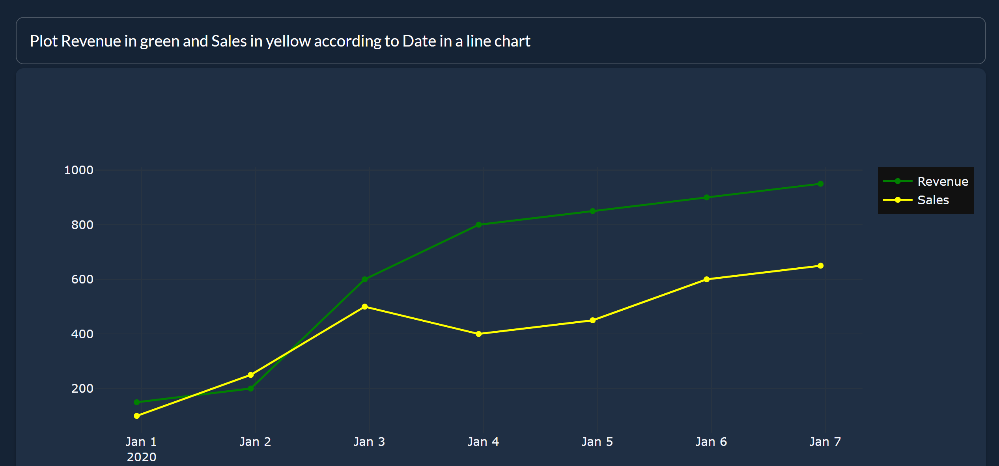

# TaipyCopilot

<p align="center">
  
</p>

Converts English sentences to Taipy Web App elements

## Current Scope:

TaipyCopilot works with few-shot learning on StarCoder.

Currently supports:
- line plots with multiple lines, colors and line styles
- bar charts

Known issues:
- Long prompts may cause StarCoder to repeat unfinished code, causing syntax errors

## Setup

**Requires a Hugging Face API key in `app.py`** 

[How to get your Hugging Face API key](https://huggingface.co/docs/hub/security-tokens#:~:text=To%20create%20an%20access%20token,you're%20ready%20to%20go!)

**1.** Clone the repo

```bash	
git clone https://github.com/AlexandreSajus/TaipyLLM.git
```

**2.** Install requirements

```bash
pip install -r requirements.txt
```

**3.** Add your Hugging Face API key to `app.py` line 7

```python
API_URL = "https://api-inference.huggingface.co/models/bigcode/starcoder"
headers = {"Authorization": "ENTER YOUR HUGGING FACE API KEY HERE"}
```

**4.** Run `app.py`

```bash
python app.py
```